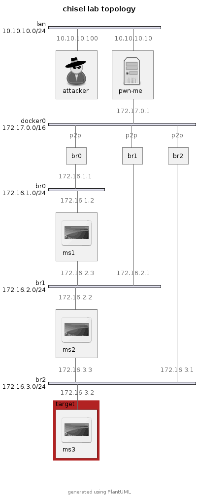

# Chisel pivoting lab

This is a lab I created during my eCPPT exam preparation to practice 
pivoting techniques with [chisel](https://github.com/jpillora/chisel), 
"a fast TCP/UDP tunnel, transported over HTTP, secured via SSH". While it's
true that most of that exam can be completed with Metasploit only, it's always
helpful to have a number of tools in your pocket.

The lab uses Docker to create three instances of the
[tleemcjr/metasploitable2](https://hub.docker.com/r/tleemcjr/metasploitable2)
image.  Modeled after TryHackMe's Wreath machine, the idea is to reach the
third Metasploitable image, as shown in the topoglogy below.

The recommended setup is to host the lab on a VM running Docker (`pwn-me` in
the topology) which is on the same subnet as the attacker machine.  This way,
the attacker machine can't use its own Docker routing to reach the target.  For
example, in VirtualBox, one could put the attacker and target VMs on the NAT
network. The [SEED Labs Ubuntu 20.04
VM](https://seedsecuritylabs.org/labsetup.html) comes with Docker
pre-installed, which makes it an excellent choice for the target machine.  If
memory is a concern, you could run it headless.

Mostly I followed [0xdf's chisel
cheat sheet](https://0xdf.gitlab.io/2020/08/10/tunneling-with-chissel-and-ssf-update.html), 
ensuring I could repeat all the things he demonstrates there.

Thanks to the practice I did in this lab, I went into my eCPPTv2 exam with the
confidence that I would have no trouble moving around the network.

